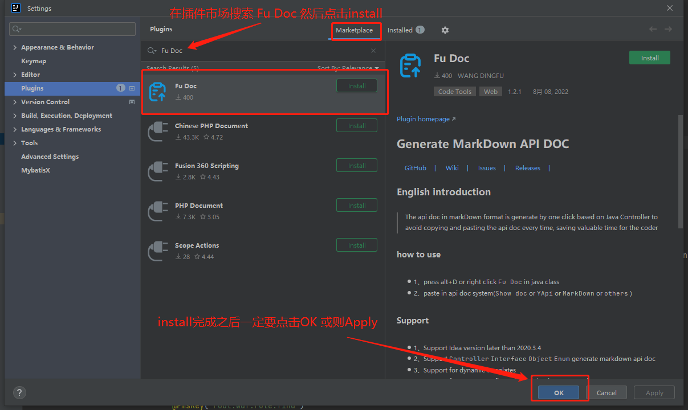

# fu-api-doc-plugin

Cancel changes

> Fu Doc是一个根据 `JAVA` 代码一键生成 `markdown` 格式接口文档的 Idea 插件。你只需要在你的开发工具里安装上Fu Doc这个插件即可，对你的项目完全零侵入。当然需要有一个良好的开发习惯（写注释的好习惯），此时你只需要一个快捷键就可以生成你平时需要耗费大量时间去复制粘贴编写的接口文档

查看[Fu Doc文档](https://wangdingfu.github.io/)详细了解

演示
---

安装步骤
---

- **在线安装:**

    - `File` -> `Setting` -> `Plugins` -> 搜索 `Fu Doc`

- **手动安装:**
    - [下载插件（Github下载,速度慢）](https://github.com/wangdingfu/fu-api-doc-plugin/releases)
    - [下载插件（蓝奏云下载,速度快）](https://wwi.lanzoup.com/b0dy2hktg) 密码：`8vec`
    - [下载插件（百度云下载）](https://pan.baidu.com/s/1cC7thCMMdcRjh24sqU59tA?pwd=8888) 密码：`8888`
    - 进入插件市场安装本地插件： `File` -> `Setting` -> `Plugins` -> `Install Plugin from Disk...`
      

使用
----

- 快捷键`ALT+D`
- 右键菜单选择 `Fu Doc`
- 去接口文档系统直接将内容粘贴即可（例如ShowDoc或者YApi等）

未来目标
----

- 支持快速调试Spring容器中所有对象的方法(解放编写单元测试)
- 支持团队协作

其他
---

- 仅支持IDEA 2020.2以上的版本
- 鼠标需要在Controller类代码块内 否则有可能会获取不到当前类导致无法生成接口文档
- 当鼠标停留在方法体内或则选中方法一部分内容在点击生成接口文档. 则只会生成当前方法的接口文档
- 小伙伴们如果使用有任何问题可以给我提Issues. 我会及时回复并解决
