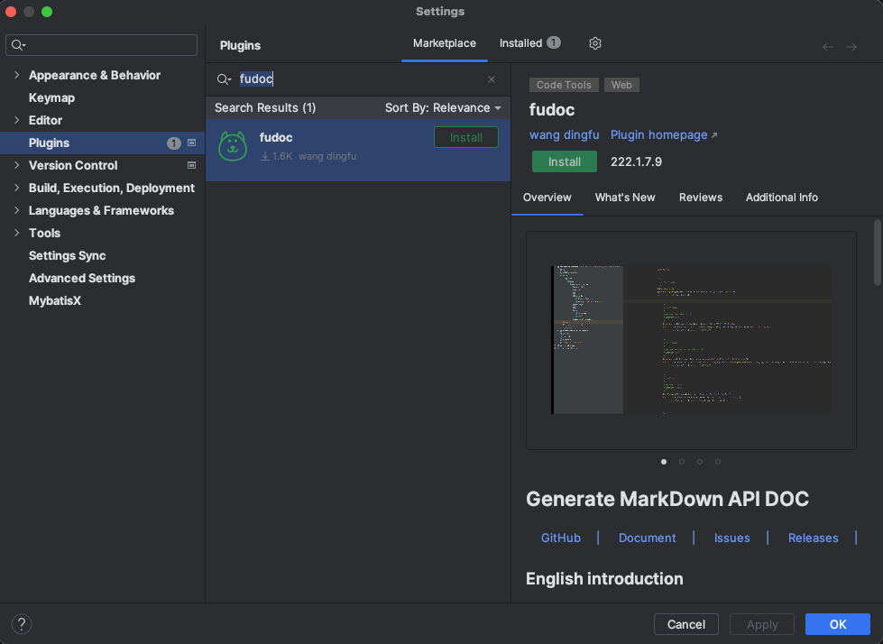

# fu-api-doc-plugin

> Fu Doc是一个根据 `JAVA` 代码一键生成接口文档，并且支持同步接口文档到`YApi`、`ShowDoc`等第三方文档系统，支持一键发起HTTP请求的 IDEA插件。你只需要在你的开发工具里安装上Fu Doc这个插件即可，他对你的项目完全零侵入。

查看[Fu Doc文档](http://www.fudoc.cn/)详细了解

演示
---

安装步骤
---

- **在线安装:**

    - `File` -> `Setting` -> `Plugins` -> 搜索 `Fu Doc`

- **手动安装:**
    - [下载插件（Github下载,速度慢）](https://github.com/wangdingfu/fu-api-doc-plugin/releases)
    - [下载插件（蓝奏云下载,速度快）](https://wwi.lanzoup.com/b0dy2hktg) 密码：`8vec`
    - [下载插件（百度云下载）](https://pan.baidu.com/s/1cC7thCMMdcRjh24sqU59tA?pwd=8888) 密码：`8888`
    - 进入插件市场安装本地插件： `File` -> `Setting` -> `Plugins`
      -> `Install Plugin from Disk...`
      

使用
----

##### 生成接口文档
- 快捷键`ALT+D` 或则 右键菜单选择 `Fu Doc`
- 去接口文档系统直接将内容粘贴即可（例如ShowDoc或者YApi等）

##### 一键发起http请求
- 快捷键`ALT+R` 或则 右键菜单选择 `Fu Request`
- 在弹出窗体中发起请求即可

##### 一键将文档同步至第三方文档系统(YApi、showDoc)
- 快捷键`ALT+S` 或则 右键菜单选择 `Fu Doc Sync`--->`Sync Api`
- 配置文档系统地址（已配置直接跳过该步骤）
- 在弹框中选中需要同步到文档系统的哪个目录 点击确定即可同步至第三方文档系统

其他
---

- Intellij Idea 版本支持2018.1 以上
- 鼠标需要在Controller类代码块内 否则有可能会获取不到当前类导致无法生成接口文档
- 当鼠标停留在方法体内或则选中方法一部分内容在点击生成接口文档. 则只会生成当前方法的接口文档
- 小伙伴们如果使用有任何问题可以给我提Issues. 我会及时回复并解决
